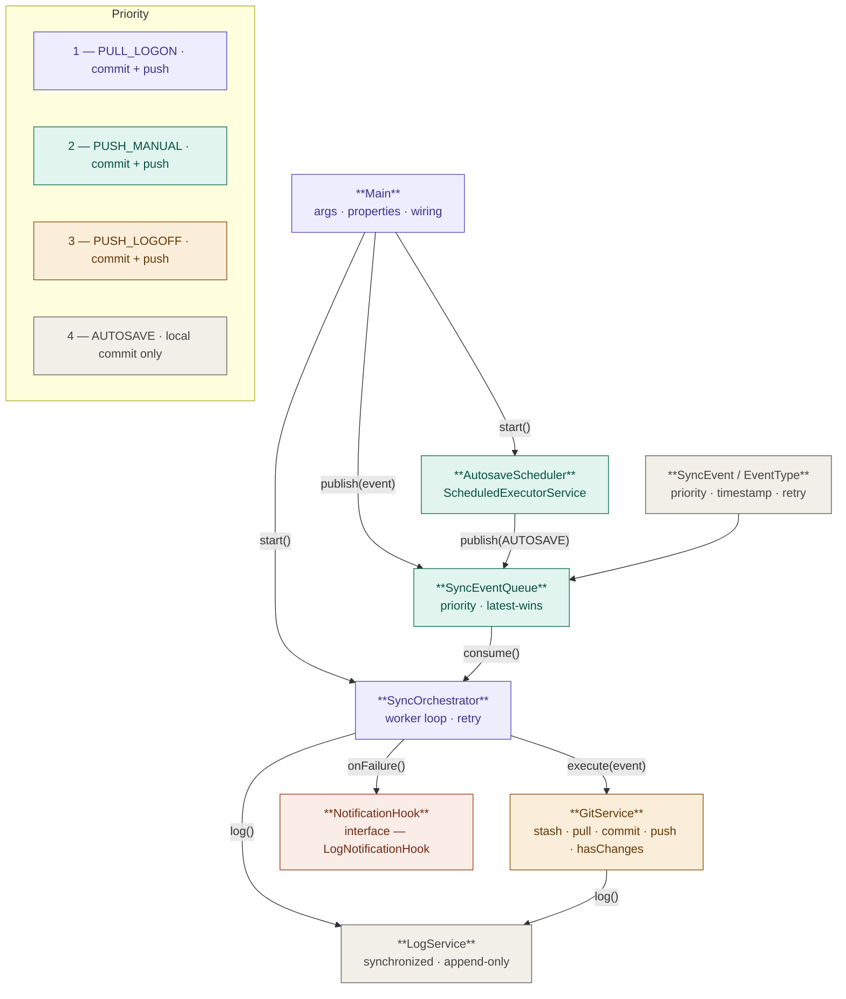

### Overall architecture

This diagram illustrates the component architecture and interaction flow of ObsidianSync.

**Main** acts as the application entry point and wiring layer — it bootstraps all dependencies,
translates CLI arguments into typed events, and delegates execution to the orchestrator.

**SyncEventQueue** is a thread-safe priority queue implementing latest-wins deduplication.
Publishers drop events in; the orchestrator pulls them out in priority order.
Lower priority number means higher urgency: a pending pull always precedes an autosave.

**SyncOrchestrator** owns the worker loop — a dedicated thread that consumes events serially,
preventing Git concurrency issues by design. On failure, it applies exponential backoff retry
(up to 3 attempts: 30s → 60s → 120s) before delegating to the NotificationHook.

**AutosaveScheduler** runs on a ScheduledExecutorService and periodically publishes AUTOSAVE
events to the queue. It never calls GitService directly — it is a publisher, not an executor.

**GitService** wraps Git CLI operations via ProcessBuilder. Each method maps to a single
Git command. Sequencing and error handling are the orchestrator's responsibility, not GitService's.

**LogService** provides levelled, append-only, thread-safe logging shared across all components.

**NotificationHook** is an interface following the Dependency Inversion Principle — the
orchestrator depends on the abstraction, not the implementation. The default implementation
(LogNotificationHook) writes failures to the log. A future tray icon implementation will
replace it without touching the orchestrator.
